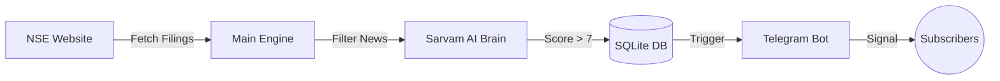

# 🚀 Market Pulse (NSE2) - Complete Project Documentation (A-Z)

Aapka ye project ek **High-Precision Market Intelligence System** hai jo NSE (National Stock Exchange) ki announcements ko real-time mein scan karke, AI ki madad se filter karta hai aur sirf kaam ki khabar (High Impact signals) subscribers tak pahunchata hai.

Is document mein hum har ek chhoti-badi cheez ko bahut hi asaan bhasha mein samjhenge.

---

## 🏗️ 1. Bot Kaise Kaam Karta Hai? (The Simple Logic)

Bot ka basic kaam 4 steps mein pura hota hai:

1.  **Fetching (Data nikaalna)**: Har 3 minute mein bot NSE ki website par jaakar dekhta hai ki kisi company ne koi nayi "Announcement" ya "Filing" dali hai ya nahi.
2.  **Filtering (Kachra saaf karna)**: NSE par roz hazaron filings aati hain. Bot routine cheezon ko (jaise Board Meeting, Address change, Shareholding update) turant discard kar deta hai.
3.  **AI Analysis (Dimag lagana)**: Agar koi "Interest" wali khabar milti hai (jaise koi bada Order ya Merger), toh bot uska PDF download karta hai, text nikaalta hai, aur **Sarvam AI** ko bhejta hai.
4.  **Alerting (Khabar dena)**: AI ussey **1 se 10** ke beech mein ek **Impact Score** deta hai. Agar score **7 se bada** hai, toh bot turant premium users ko Telegram par message bhej deta hai.

---

## 📑 2. Detailed Internal Components (Har Part Ka Kaam)

### A. Core Engine ([main.py](file:///c:/Users/Admin/OneDrive/Desktop/nse2/nse_monitor/main.py))
Ye bot ka "Sanchalak" (manager) hai.
- Ye check karta hai ki market open hai ya nahi ([is_market_hours](file:///c:/Users/Admin/OneDrive/Desktop/nse2/nse_monitor/main.py#88-92)).
- Ye scheduling sambhalta hai (subah ki report kab jayegi, maintenance kab hogi).
- **Rule of 4**: Ek cycle mein 4 se zyada alerts nahi bhejta taaki spam na ho.

### B. NSE API Client ([nse_api.py](file:///c:/Users/Admin/OneDrive/Desktop/nse2/nse_monitor/nse_api.py))
Ye bot ki "Aankhein" hain.
- NSE ki website se block naa hone ke liye ye har baar apna "ID" (User-Agent) badalta hai.
- NSE Archive se PDF download karne ki taqat ismein hai.

### C. Database ([database.py](file:///c:/Users/Admin/OneDrive/Desktop/nse2/nse_monitor/database.py)) - Storage
Bot ki "Yaaddaasht" (memory). Ismein 3 main tables hain:
1.  **News Items**: Aaj tak ki saari khabrein aur unka AI score.
2.  **Users**: Kaun premium hai, kiske kitne din bache hain.
3.  **Payment Links**: Razorpay se generate kiye gaye links ka status.

### D. User Bot & Admin Bot
- **User Bot ([telegram_bot.py](file:///c:/Users/Admin/OneDrive/Desktop/nse2/nse_monitor/telegram_bot.py))**: Ye subscribers se baat karta hai. Balance dikhana, recharge link dena, aur signals bhejna iska kaam hai.
- **Admin Bot ([admin_bot.py](file:///c:/Users/Admin/OneDrive/Desktop/nse2/admin_bot.py))**: Ye aapke liye hai. Isse aap kisi user ko free days de sakte hain ya sabko naya announcement bhej sakte hain (`/broadcast`).

---

## ⚖️ 3. "The 22 Rules" - AI Kaise Score Deta Hai?

Bot ka sabse bada USP (Unique Selling Point) iska **AI Decision System** hai. Sarvam AI ko 22 rules ki instruction di gayi hai, jinmein se main ye hain:

1.  **Forward-Looking Only**: Jo ho chuka hai (jaise kal meeting hui) uski report rejection mein jayegi. Focus sirf "Future" par hota hai.
2.  **Crore Threshold (Badi Raqam)**: Choti companies ke liye order 50 Cr aur badi companies ke liye 500 Cr se zyada hona chahiye tabhi alert aayega.
3.  **No FOMO Policy**: Purani khabron ko score 0 diya jata hai.
4.  **Sentiment Mapping**: Khabar Positive (Bullish) hai ya Negative (Bearish), ye AI decide karta hai.
5.  **Exclusions**: Dividend, address change, auditor resignations (except CEO) ko AI reject karta hai.

---

## 💰 4. Billing System: "Market Days" Concept

Ye bot traditional monthly billing nahi karta. Ye sirf **Trading Days** count karta hai:
- Agar aaj **Market Open** (Mon-Fri) hai, tabhi user ka 1 credit (day) katega.
- **Sat-Sun aur Holidays** ko bot user ke paise (credits) nahi kaatta.
- **Free Trial**: Naye user ko register karte hi **2 Free Market Days** milte hain.
- **Auto-Activation**: Razorpay par payment hote hi 1-2 minute mein bot apne aap ID activate kar deta hai.

---

## 🗓️ 5. Special Features (Utility)

- **Morning report (08:30 AM)**: Poori raat aur weekend ki sabse important khabron ka ek "Executive Summary" report bhejta hai.
- **`/bulk` Command**: NSE se aaj ke Bulk aur Block deals nikaal kar dikhata hai.
- **`/upcoming` Command**: Agle 14 dinon mein kaunsi companies ka Dividend, Split ya Bonus aane wala hai, uski list deta hai.
- **Precision Alert**: Alert message mein direct NSE ki original PDF filing ka link hota hai taaki user verify kar sake.

---

## 🚀 6. Setup & Specs (Quick Info)

- **Platform**: Linux ya Windows VPS par 24/7 chalta hai.
- **Memory**: Sirf 1GB RAM mein bhi makhan ki tarah chalta hai (RAM Balanced).
- **Security**: Admin access sirf password se milti hai.

---
### 🚦 Dataflow Diagram (Diagrammatic View)

---
*Ye project ek complete, automated trading intelligence ecosystem hai jo traders ka ghanto ka kaam seconds mein kar deta hai.*
