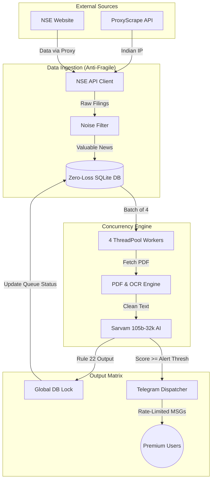

# 🚀 Market Pulse (NSE2) v1.1 - Complete Project Documentation (A-Z)

Aapka ye project ek **High-Precision Market Intelligence System** hai jo NSE (National Stock Exchange) ki announcements ko real-time mein scan karke, AI ki madad se filter karta hai aur sirf kaam ki khabar (High Impact signals) subscribers tak pahunchata hai.

Is document mein hum har ek chhoti-badi cheez ko bahut hi asaan bhasha mein samjhenge.

---

## 🏗️ 1. Bot Kaise Kaam Karta Hai? (The Simple Logic)

Bot ka basic kaam 4 steps mein pura hota hai:

1.  **Fetching (Data nikaalna)**: Har 3 minute mein bot NSE ki website (Proxy rotation ke saath) par check karta hai. Sab kuch ek **Zero-Loss Queue** (Database) mein save hota hai taaki kuch miss na ho.
2.  **Filtering (Kachra saaf karna)**: Routine filings ko exclude karke, sirf core news ko process queue mein daala jata hai.
3.  **AI Analysis (Dimag lagana)**: Bot parallel tareeqe se (4 khabrein ek saath) PDF download karta hai. Agar PDF photo hai (scanned), toh **Tesseract OCR (Vision)** use hota hai. Fir data **Sarvam 105b-32k AI Model** ko diya jata hai.
4.  **Alerting (Khabar dena)**: AI 22-Rules pakad kar **1 se 10** ke beech **Impact Score** deta hai. Badi khabar hone par turant Telegram par premium users ko link and tags ("SME" / "Big Ticket") ke saath bhejta hai.

---

## 📑 2. Detailed Internal Components (Har Part Ka Kaam)

### A. Core Engine (`main.py`)
Ye bot ka "Sanchalak" (manager) hai.
- Ye `ThreadPoolExecutor` use karke **4 AI analysis threads** ek saath chalata hai, jisse bot 4x fast ho gaya hai.
- Naya **Watchdog system** lagaya gaya hai; agar bot loop hang ho toh auto restart (`os._exit`) trigger karta hai.

### B. Security & Data Scrapers
- **NSE API Client (`nse_api.py`)**: NSE website se data nikalne wala engine.
- **Proxy Manager (`proxy_manager.py`)**: Anti-Ban system. Har NSE scan ya PDF download se pehle ek zinda Indian HTTPS proxy fetch karke lagata hai, jisse bot kabhi IP block nahi hota.
- **Vision Engine (`pdf_processor.py`)**: Filings padhne ka module. Scanned documents ko `pytesseract` image-to-text se decode karta hai.

### C. Database (`database.py`) - Storage & Queue
Bot ki "Yaaddaasht". Isme ek Hard `threading.Lock()` hai taaki backend kabhi corrupt na ho:
1.  **News Items (Queue)**: Aaj tak ki saari khabrein `status=0` (Pending) par aati hain, process hoti hain, aur `status=1/2` mein move hoti hain.
2.  **Users**: Kaun premium hai, kiske kitne din bache hain.
3.  **Payment Links**: Razorpay IDs ka hisab.

### D. User Bot & Admin Bot
- **User Bot ([telegram_bot.py](file:///c:/Users/Admin/OneDrive/Desktop/nse2/nse_monitor/telegram_bot.py))**: Ye subscribers se baat karta hai. Balance dikhana, recharge link dena, aur signals bhejna iska kaam hai.
- **Admin Bot ([admin_bot.py](file:///c:/Users/Admin/OneDrive/Desktop/nse2/admin_bot.py))**: Ye aapke liye hai. Isse aap kisi user ko free days de sakte hain ya sabko naya announcement bhej sakte hain (`/broadcast`).

---

## ⚖️ 3. "The 22 Rules" - AI Kaise Score Deta Hai?

Bot ka sabse bada USP (Unique Selling Point) iska **AI Decision System** hai. Sarvam AI ko 22 rules ki instruction di gayi hai, jinmein se main ye hain:

1.  **Forward-Looking Only**: Jo ho chuka hai (jaise kal meeting hui) uski report rejection mein jayegi. Focus sirf "Future" par hota hai.
2.  **Crore Threshold (Badi Raqam)**: Choti companies ke liye order 50 Cr aur badi companies ke liye 500 Cr se zyada hona chahiye tabhi alert aayega.
3.  **No FOMO Policy**: Purani khabron ko score 0 diya jata hai.
4.  **Sentiment Mapping**: Khabar Positive (Bullish) hai ya Negative (Bearish), ye AI decide karta hai.
5.  **Exclusions**: Dividend, address change, auditor resignations (except CEO) ko AI reject karta hai.

---

## 💰 4. Billing System: "Market Days" Concept

Ye bot traditional monthly billing nahi karta. Ye sirf **Trading Days** count karta hai:
- Agar aaj **Market Open** (Mon-Fri) hai, tabhi user ka 1 credit (day) katega.
- **Sat-Sun aur Holidays** ko bot user ke paise (credits) nahi kaatta.
- **Free Trial**: Naye user ko register karte hi **2 Free Market Days** milte hain.
- **Auto-Activation**: Razorpay par payment hote hi 1-2 minute mein bot apne aap ID activate kar deta hai.

---

## 🗓️ 5. Special Features (Utility)

- **Morning report (08:30 AM)**: Poori raat aur weekend ki sabse important khabron ka ek "Executive Summary" report bhejta hai.
- **`/bulk` Command**: NSE se aaj ke Bulk aur Block deals nikaal kar dikhata hai.
- **`/upcoming` Command**: Agle 14 dinon mein kaunsi companies ka Dividend, Split ya Bonus aane wala hai, uski list deta hai.
- **Precision Alert**: Alert message mein direct NSE ki original PDF filing ka link hota hai taaki user verify kar sake.

---

## 🚀 6. Setup & Specs (Quick Info)

- **Platform**: Linux ya Windows VPS par 24/7 chalta hai.
- **Memory**: Sirf 1GB RAM mein bhi makhan ki tarah chalta hai (RAM Balanced).
- **Security**: Admin access sirf password se milti hai.

---
### 🚦 v1.1 Dataflow Diagram (Architectural View)

---
*Ye project ek complete, automated trading intelligence ecosystem hai jo traders ka ghanto ka kaam seconds mein kar deta hai.*
