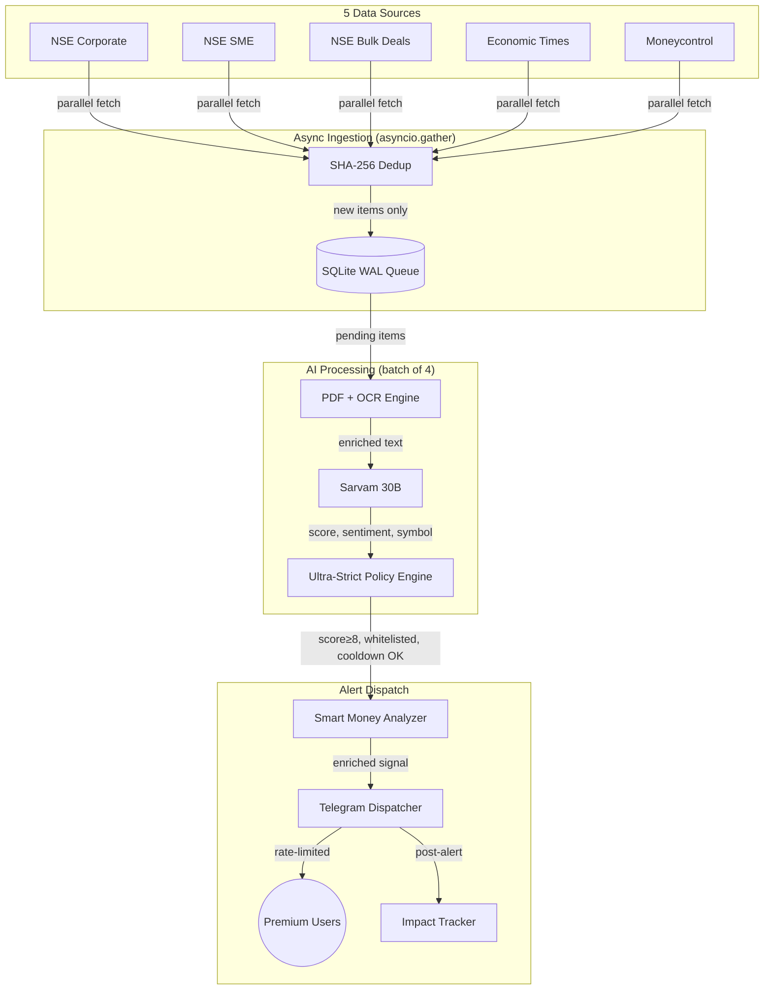

# 🚀 Bulkbeat TV v2.0 — Complete Project Documentation

Ek **High-Precision Market Intelligence System** jo NSE ki announcements ko real-time mein scan karke, AI se filter karta hai aur sirf kaam ki khabar (High Impact signals) subscribers tak pahunchata hai.

---

## 🏗️ 1. Bot Kaise Kaam Karta Hai?

Bot ka kaam 4 steps mein pura hota hai:

1. **Fetching**: Har 3 minute mein 5 sources se async parallel fetch hota hai. Sab kuch **Zero-Loss SQLite Queue** mein save hota hai.
2. **Deduplication**: SHA-256 content hash se duplicate items filter hote hain before DB insert.
3. **AI Analysis**: Pending items batch of 4 mein async process hote hain. PDF hai toh download + OCR, fir **Sarvam 30B** (`sarvam-30b`) ko diya jata hai.
4. **Alerting**: AI **Impact Score 1-10** deta hai. Ultra-Strict policy ke through pass hone par Telegram par premium users ko alert bheja jata hai.

---

## 📑 2. Internal Components

### A. Core Engine (`main.py`) — `MarketIntelligenceSystem`
- Fully `asyncio`-native. Koi ThreadPool nahi.
- `run_cycle()` mein 5 sources ko `asyncio.gather()` se parallel fetch karta hai.
- `_process_single_item()` mein PDF download, OCR, AI analysis, aur alert dispatch hota hai.
- **Single-instance lock**: PID file se ensure karta hai ki ek hi process chale.
- **Startup warmup**: Boot par 3 forced cycles chalata hai.

### B. Data Sources (`sources/`)
| Source | Class | Type |
|--------|-------|------|
| NSE Corporate Filings | `NSESource` | Live alerts |
| NSE SME Filings | `NseSmeSource` | Live alerts |
| NSE Bulk/Block Deals | `BulkDealSource` | Live alerts (≥ ₹5 Cr) |
| Economic Times | `EconomicTimesSource` | Ingest-only (no alerts) |
| Moneycontrol | `MoneycontrolSource` | Ingest-only (no alerts) |

### C. NSE API Client (`nse_api.py`)
- NSE website se async data fetch karta hai.
- `on_403` callback: IP ban hone par Admin ko Telegram alert bhejta hai.

### D. PDF & OCR Engine (`pdf_processor.py`)
- PDF download karta hai, text extract karta hai.
- Scanned/image PDFs ke liye `pytesseract` OCR (120 DPI, RAM-safe serial processing).
- Enriched text `[ENRICHMENT]` tag ke saath AI ko bheja jata hai.

### E. AI Processor (`llm_processor.py`)
- **Sarvam 30B** (`sarvam-30b`) model use karta hai.
- Output: `impact_score`, `sentiment`, `symbol`, `trigger`, `sector`, `valid_event`.

### F. Database (`database.py`)
- SQLite WAL mode, 30s busy-timeout.
- Tables: news queue, users, payment links, admin sessions, system config, alert history.
- `backup()`: SQLite Online Backup API se daily hot-backup.

### G. Scheduler (`scheduler.py`) — `MarketScheduler`
APScheduler (AsyncIO) se 7 jobs:

| Job | Time (IST) | Frequency |
|-----|-----------|-----------|
| Intelligence Cycle | Every 3 min | Continuous |
| Payment Check | Every 5 min | Continuous |
| Pre-Market Report | 08:30 | Mon-Fri |
| EOD Billing | 16:00 | Mon-Fri |
| Daily Maintenance | 00:01 | Daily |
| Weekly Memory Flush | Sun 02:00 | Weekly |
| Holiday Calendar Sync | Sun 03:00 | Weekly |

**Startup catch-up**: Agar bot 08:30–09:15 ke beech start ho toh report turant bhejta hai.

### H. User Bot (`telegram_bot.py`) & Admin Bot (`admin_bot.py`)
- **User Bot**: `/start`, `/hisab`, `/bulk`, `/upcoming`, `/recharge`
- **Admin Bot**: `/pulse`, `/broadcast`, `/grant`, `/login`

### I. Supporting Modules
- **`market_analyzer.py`**: Smart money / institutional flow analysis (score ≥ 7 par trigger).
- **`impact_tracker.py`**: Alert ke baad price movement track karta hai.
- **`nudge_manager.py`**: Inactive users ko automated re-engagement messages.
- **`trading_calendar.py`**: NSE holidays + trading day detection.
- **`watchdog.py`**: Service health monitoring.
- **`report_builder.py`**: Morning pre-market intelligence report generator.

---

## ⚖️ 3. Alert Policy — `ULTRA_STRICT_8PLUS`

Live market hours mein alert ke liye **saari conditions** pass karni hoti hain:

1. **Score ≥ 8** (Sarvam AI output)
2. **`valid_event = True`** (AI ne confirm kiya)
3. **Source whitelist**: Sirf `NSE`, `NSE_SME`, `NSE_BULK` — ET/MC ingest-only hain
4. **Neutral Block**: `sentiment = Neutral` hone par alert nahi
5. **Bulk Deal Filter**: `NSE_BULK` source ke liye deal value ≥ ₹5 Cr
6. **Symbol Cooldown**: Ek symbol par 90 min mein ek hi alert
7. **Daily Hard Cap**: Max 10 alerts/day (score ≥ 9 bypass kar sakta hai)
8. **Post-Market**: Market band hone ke baad sirf score = 10 alerts fire hote hain

---

## 💰 4. Billing System — Market Days

- Sirf **Trading Days** count hote hain (Mon-Fri, NSE holidays exclude).
- **16:00 IST** par EOD billing: `decrement_working_days()` call.
- **Free Trial**: Naye user ko 2 free market days.
- **Auto-Activation**: Razorpay payment verify hone par 1-2 min mein auto-activate.

### Subscription Plans
| Plan | Amount | Market Days |
|------|--------|-------------|
| Market Trial | ₹99 | 2 days |
| Growth Value | ₹499 | 7 days |
| Institutional Pro | ₹999 | 28 days |
| Annual Industry Partner | ₹7,999 | 336 days |

---

## 🗓️ 5. Special Features

- **Morning Report (08:30)**: Raat aur weekend ki top signals ka executive summary. Monday ko 64 hours ka data, baaki din 18 hours.
- **`/bulk`**: NSE ke aaj ke Bulk/Block deals.
- **`/upcoming`**: Agle 14 din ke Dividend, Split, Bonus events.
- **Smart Money**: Score ≥ 7 par institutional flow analysis auto-trigger.
- **Impact Tracking**: Alert ke baad price movement record hota hai accuracy ke liye.

---

## 🚀 6. Specs

- **Runtime**: Python 3.8+, fully async (`asyncio`)
- **Memory**: 200–400 MB (1GB VPS comfortable)
- **DB**: SQLite WAL, auto-backup, 5 copies retained
- **Logs**: Rotating file handler, 5MB × 3 files

---

## 🔄 v2.0 Dataflow Diagram

